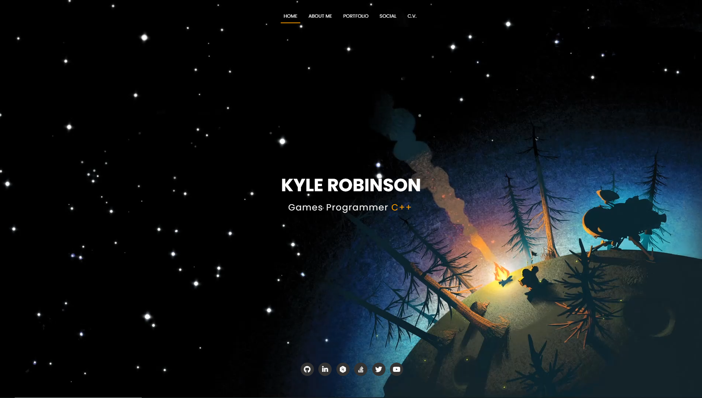

# My Online Portfolio

&nbsp;

&nbsp;

&nbsp;

&nbsp;

My online Portfolio showcasing university work and passion projects.

*- Click image to view online portfolio -*

---

### Credits

	Template:
		https://bootstrapmade.com/regna-bootstrap-onepage-template/
		https://bootstrapmade.com/license/

	Icons:
		Font Awesome (fontawesome.io)
		Eucalyp (www.flaticon.com)
		Vitaly Gorbachev (www.flaticon.com)

	Photos:
		Photo by Belle Co from Pexels
		Photo by Aleksandar Pasaric from Pexels
		Photo by Evgeny Tchebotarev from Pexels

	Other:
		jQuery (jquery.com)
		Responsive Tools (github.com/ajlkn/responsive-tools)
